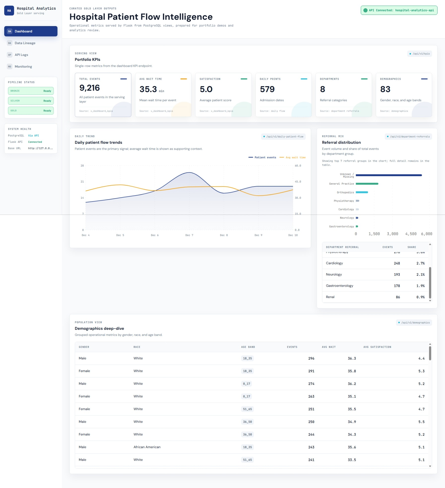

# Hospital Analytics

End-to-end hospital analytics case study built around a local medallion-style data pipeline, PostgreSQL serving layer, Flask API, and React dashboard.

## Project Overview

This project demonstrates how a raw hospital patient-flow dataset can be transformed into curated analytical outputs for dashboard consumption. The implementation follows a portfolio-grade data engineering path: land and profile the source data, standardize it into a cleaner analytical grain, publish Gold outputs into PostgreSQL, expose them through a Flask API, and consume them from a React dashboard.

The goal is not to present a production healthcare platform. The goal is to show clear data layer boundaries, practical serving patterns, and an inspectable end-to-end implementation that can be reviewed locally.

## Architecture Flow

```text
Kaggle Dataset
-> Bronze
-> Silver
-> Gold
-> PostgreSQL (analytics / serving)
-> Flask API
-> React Dashboard
```

Layer responsibilities:

- **Kaggle Dataset:** source patient-flow data used for the local portfolio case.
- **Bronze:** raw landed files, inventory metadata, and profiling while preserving source fidelity.
- **Silver:** row-preserving cleaned patient-flow records with standardized names, safer types, trimmed text fields, and normalized null handling.
- **Gold:** dashboard-ready analytical outputs for daily flow, department referrals, demographics, and KPIs.
- **PostgreSQL:** local `analytics` tables and `serving` views over curated Gold outputs.
- **Flask API:** JSON endpoints over the PostgreSQL serving views.
- **React Dashboard:** Vite/TypeScript frontend that consumes the Flask API.

## Dashboard Preview

The current dashboard overview screenshot is captured from the implemented React dashboard and is included as proof of the serving-to-frontend path.



More screenshots may be added later as the project presentation expands. Missing future views are intentionally not referenced here so the README stays accurate in GitHub.

## Implemented Stack

- Python
- Pandas
- Kaggle dataset ingestion through `kagglehub`
- PostgreSQL
- Flask
- psycopg
- React
- Vite
- TypeScript
- Recharts

## Implemented Components

- [Bronze Layer](docs/bronze.md): raw file inventory, main CSV selection, profiling, and metadata output.
- [Silver Layer](docs/silver.md): row-preserving cleaned patient-flow artifact and metadata.
- [Gold Layer](docs/gold.md): curated analytical CSV outputs for dashboard-ready reporting.
- [Serving Layer](docs/serving.md): PostgreSQL tables and serving views over Gold outputs.
- [API Layer](docs/api.md): Flask endpoints for KPIs, daily patient flow, department referrals, and demographics.
- [Dashboard](dashboard/README.md): React + Vite frontend consuming the Flask API.
- [Demo / Run Guide](docs/demo.md): concise local execution flow for demos and reviewers.

## How to Run Locally

Use the [Demo / Run Guide](docs/demo.md) for the full local walkthrough. The main review flow is:

1. Activate the Python virtual environment from the repository root.
2. Refresh Gold outputs if needed.
3. Load PostgreSQL serving tables and views.
4. Start the Flask API.
5. Start the React dashboard.
6. Open the Vite local URL in the browser.

Typical local commands:

```powershell
.\.venv\Scripts\Activate.ps1
python projects/01-hospital-analytics/src/jobs/run_gold.py
python projects/01-hospital-analytics/src/jobs/run_serving.py
python projects/01-hospital-analytics/api/app.py
```

In a second terminal:

```powershell
cd projects/01-hospital-analytics/dashboard
if (!(Test-Path .env)) { Copy-Item .env.example .env }
npm install
npm run dev
```

Local PostgreSQL credentials are read from `.env`; use `.env.example` as the template. The dashboard expects the Flask API base URL to be available through `VITE_API_BASE_URL`, typically:

```text
VITE_API_BASE_URL=http://127.0.0.1:5000
```

## Project Structure

- [`data/`](data/): local medallion-aligned storage for Bronze, Silver, and Gold artifacts.
- [`src/`](src/): ingestion, processing, quality, serving, utility, and job modules.
- [`api/`](api/): lightweight Flask API over PostgreSQL serving views.
- [`dashboard/`](dashboard/): React + Vite dashboard over the Flask API.
- [`docs/`](docs/): layer documentation, implementation notes, demo guide, and presentation assets.
- [`dbt/`](dbt/): DBT scaffold and placeholder models for future transformation work.
- [`notebooks/`](notebooks/): exploratory and validation notebooks.
- [`tests/`](tests/): unit and integration test placeholders.

## Current Status

The local end-to-end path is implemented and documented:

```text
raw Kaggle dataset -> local medallion files -> PostgreSQL serving views -> Flask JSON API -> React dashboard
```

The project is suitable for portfolio review and local demonstration. It remains intentionally lightweight: it does not include production orchestration, authentication, deployment infrastructure, Spark execution, or production DBT models.

## Future Iterations

- Add additional screenshots for KPI, chart, API, and PostgreSQL validation views when captured from the real project.
- Add a simple architecture diagram that reflects the implemented flow.
- Replace or complement Pandas jobs with PySpark when the local environment supports it.
- Promote DBT placeholders into real models and tests.
- Add orchestration and CI checks for repeatable pipeline execution.
- Add deployment documentation or infrastructure after the local case is stable.
- Expand test coverage around processing, serving, and API behavior.

These are future iterations, not current production claims.
