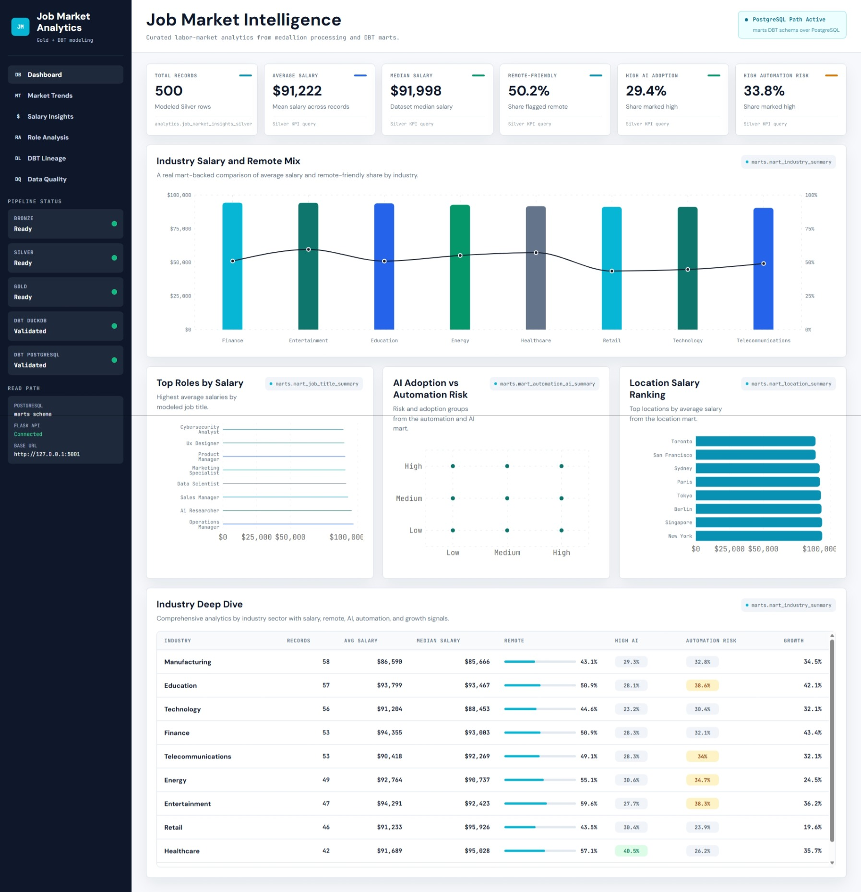

# Job Market Analytics

End-to-end job market analytics case study using the Kaggle dataset `uom190346a/ai-powered-job-market-insights`.

This project is the second portfolio case in the repository. It demonstrates a complete local analytics workflow for labor-market data: Python medallion processing, dual DBT modeling paths, PostgreSQL marts, a read-only Flask API, and a React dashboard consuming the real API.

## Project Overview

`02-job-market-analytics` analyzes AI-era job market signals such as job titles, industries, locations, salary ranges, automation risk, and AI adoption.

The implementation starts with a raw Kaggle dataset and moves it through:

- Bronze raw landing and profiling.
- Silver standardized, row-preserving records.
- Gold analytical summaries generated in Python.
- DBT marts modeled through both DuckDB and PostgreSQL paths.
- A PostgreSQL-backed read layer.
- A read-only Flask API.
- A React dashboard connected to the API.

The case is intentionally local-first and portfolio-oriented. It shows practical engineering choices without claiming production deployment, orchestration, or enterprise hardening.

## Why This Case Exists

The first portfolio case, [`01-hospital-analytics`](../01-hospital-analytics/), demonstrates a hospital operations pipeline with PostgreSQL serving views, a Flask API, and a React dashboard.

This case expands the portfolio in a different direction:

- Different domain: labor-market and AI impact analytics instead of hospital patient-flow analytics.
- Stronger SQL modeling emphasis through DBT.
- Two modeling runtimes: DuckDB for local file-based development and PostgreSQL for relational mart serving.
- A dashboard/API read layer over DBT marts rather than only Python-generated Gold files.
- A second proof that the repository can support more than one analytical product pattern.

Together, the two cases show both reusable data engineering fundamentals and domain-specific implementation choices.

## Architecture Flow

```text
Kaggle dataset
-> Bronze raw landing and profiling
-> Silver standardized job-market records
-> Gold analytical summaries
-> DBT path A: DuckDB marts over Silver CSV
-> DBT path B: PostgreSQL marts over loaded Silver data
-> Flask read-only API
-> React dashboard
```

## Dashboard Preview



This screenshot is the current dashboard implementation proof for the case study. The React dashboard is not a mockup: it reads from the Flask API, which reads from PostgreSQL Silver data and DBT marts.

## Implemented Stack

- **Python**: ingestion, Bronze profiling, Silver standardization, Gold summaries, PostgreSQL loading.
- **Pandas**: local medallion transformations and profiling.
- **DuckDB**: local DBT development over the Silver CSV artifact.
- **PostgreSQL**: relational Silver load and DBT mart materialization.
- **DBT**: staging, intermediate, mart models, sources, model tests, and singular tests.
- **Flask**: thin read-only API for dashboard access.
- **React + Vite + TypeScript**: dashboard frontend over the API.
- **PowerShell helper scripts**: DBT execution for DuckDB and PostgreSQL targets.

## Modeling Paths

### Path A: DuckDB Local Modeling

The DuckDB path supports fast local analytical modeling over the Silver CSV artifact.

```text
Silver CSV -> DBT DuckDB source -> staging -> intermediate -> marts -> local DuckDB database
```

Run from the DBT project directory:

```powershell
cd projects/02-job-market-analytics/dbt
.\scripts\run_dbt_duckdb.ps1 debug
.\scripts\run_dbt_duckdb.ps1 run
.\scripts\run_dbt_duckdb.ps1 test
```

The local DuckDB database is written to:

```text
projects/02-job-market-analytics/data/job_market_analytics.duckdb
```

### Path B: PostgreSQL-Backed Modeling

The PostgreSQL path loads Silver records into PostgreSQL and materializes DBT marts in the `marts` schema.

```text
Silver CSV -> analytics.job_market_insights_silver -> DBT PostgreSQL source -> staging -> intermediate -> marts
```

Load Silver and run the PostgreSQL DBT target:

```powershell
python projects/02-job-market-analytics/src/jobs/run_postgres_load.py
cd projects/02-job-market-analytics/dbt
.\scripts\run_dbt_postgres.ps1 debug
.\scripts\run_dbt_postgres.ps1 run
.\scripts\run_dbt_postgres.ps1 test
```

Implemented PostgreSQL outputs:

```text
analytics.job_market_insights_silver
marts.mart_job_title_summary
marts.mart_industry_summary
marts.mart_location_summary
marts.mart_automation_ai_summary
```

## API and Dashboard Read Layer

The Flask API is intentionally thin and read-only. It does not rebuild transformation logic in the API layer. It reads from PostgreSQL Silver data and DBT marts, then exposes dashboard-oriented JSON endpoints.

Primary endpoints:

```text
GET /health
GET /api/v1/kpis
GET /api/v1/job-titles
GET /api/v1/industries
GET /api/v1/locations
GET /api/v1/automation-ai
```

The React dashboard consumes these endpoints directly. It is the presentation layer for the modeled data, not a separate analytical engine.

## How to Run Locally

From the repository root, activate the Python environment and install dependencies:

```powershell
.\.venv\Scripts\Activate.ps1
python -m pip install -r requirements.txt
```

Run the Python medallion pipeline:

```powershell
python projects/02-job-market-analytics/src/jobs/run_ingestion.py
python projects/02-job-market-analytics/src/jobs/run_bronze.py
python projects/02-job-market-analytics/src/jobs/run_silver.py
python projects/02-job-market-analytics/src/jobs/run_gold.py
```

Run the DuckDB DBT path:

```powershell
cd projects/02-job-market-analytics/dbt
.\scripts\run_dbt_duckdb.ps1 debug
.\scripts\run_dbt_duckdb.ps1 run
.\scripts\run_dbt_duckdb.ps1 test
cd ../../..
```

Run the PostgreSQL load and DBT path after configuring `projects/02-job-market-analytics/.env`:

```powershell
python projects/02-job-market-analytics/src/jobs/run_postgres_load.py
cd projects/02-job-market-analytics/dbt
.\scripts\run_dbt_postgres.ps1 debug
.\scripts\run_dbt_postgres.ps1 run
.\scripts\run_dbt_postgres.ps1 test
cd ../../..
```

Start the API:

```powershell
.\.venv\Scripts\python.exe projects/02-job-market-analytics/api/app.py
```

By default, the API runs at:

```text
http://127.0.0.1:5001
```

Start the dashboard:

```powershell
cd projects/02-job-market-analytics/dashboard
npm install
npm run dev
```

Generated data artifacts are local-only and ignored by Git.

## Project Structure

```text
projects/02-job-market-analytics/
|-- api/                 # Read-only Flask API over PostgreSQL Silver and DBT marts
|-- dashboard/           # React + Vite dashboard consuming the API
|-- data/                # Local generated Bronze, Silver, Gold, and DuckDB artifacts
|-- dbt/                 # Shared DBT project for DuckDB and PostgreSQL targets
|-- docs/                # Layer docs, API notes, and portfolio assets
|-- notebooks/           # Exploratory source profiling notebook
|-- src/                 # Python ingestion, processing, quality, loading, and job modules
|-- tests/               # Test placeholders and validation surface
|-- .env.example         # Local configuration template
`-- README.md            # Case study overview
```

## Current Status

Implemented today:

- Kaggle ingestion into a local Bronze raw area.
- Bronze file inventory, profiling, and metadata generation.
- Silver row-preserving standardization.
- Gold analytical summaries.
- DBT DuckDB modeling over Silver CSV.
- PostgreSQL Silver loading.
- DBT PostgreSQL modeling into marts.
- DBT source, model, and singular tests.
- Read-only Flask API over PostgreSQL data.
- React dashboard consuming the real API.
- Portfolio screenshot for the dashboard.

Not claimed today:

- Cloud deployment.
- Orchestration.
- CI/CD automation.
- Authentication or authorization.
- Production API hardening.
- Production data contracts or SLAs.

## Future Iterations

- Add a repository-level architecture diagram for the second case.
- Add captured validation assets for Postman, PostgreSQL marts, and DBT runs/tests.
- Add DBT docs generation artifacts or exposures if the project moves toward richer lineage presentation.
- Add orchestration once the local workflow is stable enough to justify it.
- Add deployment notes only after there is a real deployed environment to document.
