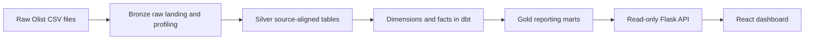

# Retail Revenue Analytics

Retail and e-commerce analytics case study using the Kaggle dataset `olistbr/brazilian-ecommerce`.

This is the third portfolio case in the repository. It implements a local Bronze layer, source-aligned Silver tables, cautious Python Gold v1 KPI summaries, DBT DuckDB dimensional marts, and a thin read-only Flask API over those marts. The project remains local-first and portfolio-oriented, with no production maturity claims.

## Why This Case Exists

The repository already contains:

- `01-hospital-analytics`: a hospital operations analytics case with serving-oriented outputs.
- `02-job-market-analytics`: a job market analytics case with Python processing, DBT marts, API, and dashboard layers.

This third case adds a retail marketplace domain with stronger dimensional modeling emphasis. It shows how a multi-table source can move from raw files to source-aligned Silver tables, then into fact, dimension, mart-style SQL models, a read-only API, and a local dashboard.

The project proves:

- source-aware Silver design;
- careful order, item, payment, product, customer, and seller relationships;
- item-grain sales modeling;
- payment duplication avoidance;
- DBT as a local modeling and testing layer;
- a thin analytical serving contract over modeled marts;
- a React presentation layer over the analytical API;
- a cleaner Docker packaging path for local demos and reproducibility;
- a clean path toward future orchestration without adding it prematurely.

## What To Review First

For a quick technical review, start with:

- [DBT marts](dbt/models/marts): dimensional outputs, fact grain, and business summary marts.
- [DBT tests](dbt/tests): custom data quality checks for payment aggregation, fact grain, non-negative measures, and valid dates.
- [API contract](api/app.py): read-only Flask routes over the modeled DuckDB marts.
- [Dashboard](dashboard/src/pages/DashboardPage.tsx): local analytics presentation backed by the API.
- [KPI definitions](docs/kpis.md): formulas, metric intent, and source-data caveats.

## Evaluate In 5 Minutes

From the repository root on Windows PowerShell:

```powershell
Set-Location .\projects\03-retail-revenue-analytics
.\scripts\dbt_build.ps1 build
..\..\.venv\Scripts\python.exe .\api\app.py
```

In a second terminal:

```powershell
Set-Location .\projects\03-retail-revenue-analytics
.\scripts\start_dashboard.ps1
```

Then verify:

- dbt finishes with `PASS=139 WARN=0 ERROR=0`.
- API health opens at `http://127.0.0.1:5002/health`.
- API index opens at `http://127.0.0.1:5002/api/v1`.
- Dashboard opens at `http://127.0.0.1:5173`.
- KPI cards, charts, and tables load from the local API.

## Key Business Insights

The project is designed to answer marketplace revenue questions without mixing grains:

- Revenue performance is measured from order-item sales values, so category, seller, customer-state, and daily trends avoid payment-row duplication.
- Payment behavior is modeled separately by payment type, keeping payment mix analysis distinct from item-side sales revenue.
- Seller and customer geography outputs make it easy to compare marketplace concentration by state.
- Order status remains visible in the marts and dashboard, allowing reviewers to see how non-delivered statuses affect analytical totals instead of silently filtering them away.
- The KPI layer exposes total orders, item rows, item revenue, freight, gross merchandise value, and item-side average order value as reviewer-friendly summary measures.

## Business Problem

Retail leaders need a reliable way to understand revenue performance across products, categories, sellers, customer regions, order status, and payment behavior. The raw Olist export is spread across orders, items, products, customers, sellers, and payments, so direct reporting can easily double-count revenue or mix grains.

This project turns those source tables into a batch-built analytical model that answers business questions such as:

- Which product categories generate the most item-side revenue?
- Which sellers or seller states drive the strongest marketplace performance?
- How does daily revenue change by order status?
- Which customer states contribute the most orders and revenue?
- Which payment methods are most common, and how large are their payment values?
- How many order-item rows, orders, and item-side sales dollars are represented in the model?

## Business Value

The model helps a retail analytics team prioritize category investment, review seller performance, monitor order-status impact on revenue, understand regional demand, and separate product-sales metrics from payment behavior. It is intentionally shaped as a portfolio case study for dimensional modeling and KPI design rather than as an accounting ledger.

## Dataset Choice

This project uses the Olist Brazilian E-Commerce Public Dataset from Kaggle:

- Kaggle handle: `olistbr/brazilian-ecommerce`
- Local raw folder name: `olist_brazilian_ecommerce`

Olist is a strong fit because it has multiple related CSV files instead of one flat sales table. The landed dataset includes orders, order items, payments, products, category translations, customers, sellers, reviews, and geolocation.

## Current Architecture Flow

```text
Kaggle dataset
-> Bronze raw landing and profiling
-> Silver source-aligned standardized tables
-> Gold Python KPI summaries
-> DBT DuckDB staging/intermediate/marts
-> Flask read-only API
-> React dashboard
```



## Implemented Layers

### Bronze

Bronze lands the Olist dataset locally, inventories all raw files, profiles the largest supported CSV with Pandas, and writes metadata.

The largest-CSV profiling rule is only a raw-stage convenience. It is not a final fact-grain decision.

### Silver

Silver v1 produces one source-aligned CSV per selected core table:

```text
orders
order_items
order_payments
products
product_category_name_translation
customers
sellers
```

Silver preserves each source table grain. It applies safe standardization only and does not aggregate, deduplicate, create surrogate keys, or join everything into one canonical table.

### Python Gold v1

Python Gold v1 produces first-pass revenue and business KPI summaries as CSV files. It uses item-side measures from `order_items` and summarizes payments separately by payment type.

### DBT DuckDB Marts

DBT reads the Silver CSV outputs and builds:

Dimensions:

- `dim_product`
- `dim_customer`
- `dim_seller`
- `dim_store`
- `dim_salesperson`
- `dim_date`

Fact-like mart:

- `fct_sales`

Business marts:

- `mart_daily_revenue`
- `mart_category_performance`
- `mart_seller_performance`
- `mart_customer_state_performance`
- `mart_order_status_summary`
- `mart_payment_type_summary`

The DBT path is DuckDB-first and local. It does not require PostgreSQL in this phase.

### Flask Read-Only API

The API reads from the already-modeled DuckDB marts and returns JSON responses for business-friendly endpoints such as KPIs, daily revenue, category performance, seller performance, customer-state performance, order-status summary, and payment-type summary.

The API is thin by design. It does not run DBT, rebuild marts, recalculate business logic from raw files, or write data.

### React Dashboard

The dashboard consumes the API and presents the case as a local analytics product. It includes KPI cards, daily revenue trend, category performance, seller performance, customer state performance, order status, and payment type sections.

The dashboard keeps business logic in the modeled layers and API contract. React handles API consumption, rendering, formatting, loading states, empty states, and error states.

## Revenue And Grain Rules

The central analytical fact is `fct_sales`, which represents the conceptual `fact_sales` model for this portfolio case.

Fact grain: one row per sold item per order, identified by `order_id` and `order_item_id`.

Core dimensional model:

- `fact_sales` / implemented as `fct_sales`: one order-item row with item-side revenue measures and order-level payment context.
- `dim_date`: purchase-date calendar attributes.
- `dim_product`: product and category attributes.
- `dim_customer`: customer identity and coarse geography.
- `dim_store`: seller storefront proxy because Olist does not provide physical stores.
- `dim_salesperson`: seller proxy because Olist does not provide named salespeople.
- `dim_seller`: retained source-aligned marketplace seller dimension used by existing marts and dashboard endpoints.

Item-side measures:

- `item_price = order_items.price`
- `freight_value = order_items.freight_value`
- `gross_merchandise_value = item_price + freight_value`

Raw payment rows are not joined directly to item rows. DBT aggregates payments to one row per order before adding payment context to `fct_sales`.

Payment fields in `fct_sales` are order-level context. They can repeat across multi-item orders and should not be summed as item-level sales revenue.

## KPI Definitions

Primary KPIs are documented in [KPI definitions](docs/kpis.md). The core implemented metrics are:

- `gross_revenue`: `sum(item_price + freight_value)`.
- `net_revenue`: `sum(item_price)`.
- `units_sold`: `count(*)` at `fct_sales` grain.
- `order_count`: `count(distinct order_id)`.
- `average_order_value`: `sum(item_price) / count(distinct order_id)`.

Discount, margin, and profit metrics are documented as future-ready definitions, but they are not calculated because the selected Olist source tables do not contain discount, product cost, fee, tax, or settlement inputs.

## Batch Load Strategy

This project uses full-batch local rebuilds. Silver and Gold outputs are overwritten on each run, and dbt rebuilds DuckDB marts from the current Silver tables. That makes reruns safe for the same raw inputs and keeps the portfolio workflow easy to inspect.

The next incremental step would be partitioned processing by `order_purchase_date` with a lookback window for late-arriving order items, payment records, or status changes. Current duplicate protection is expressed through source-grain and fact-grain tests instead of hidden append logic.

## Data Quality Checks

Data quality is handled with dbt tests and lightweight Python run metadata. Current checks validate:

- no nulls in critical keys;
- uniqueness where dimensions or source grains require it;
- referential integrity between `fct_sales` and dimensions;
- no duplicate fact rows at `order_id` and `order_item_id` grain;
- non-negative sales and payment values;
- valid purchase dates;
- order-level payment aggregation before joining to item-grain facts.

See [Data quality and rerun safety](docs/data_quality.md) for the validation and observability details.

## Design Trade-offs

Batch instead of streaming: Olist is a static analytical export, and the business questions are periodic revenue-analysis questions. Batch processing keeps the logic reproducible and avoids unnecessary infrastructure.

Dimensional modeling: the source has multiple natural grains, so facts and dimensions make KPI definitions clearer and reduce double-counting risk, especially around payments and order items.

Bridge toward dbt marts: Python handles raw local file preparation, while dbt owns modeled analytical contracts, tests, and future mart evolution. This creates a clean path toward orchestration later without adding orchestration before it is useful.

## Documentation

- [Bronze layer](docs/bronze.md)
- [Source tables](docs/source_tables.md)
- [Silver plan](docs/silver_plan.md)
- [Silver layer](docs/silver.md)
- [Gold layer](docs/gold.md)
- [KPI definitions](docs/kpis.md)
- [Data quality and rerun safety](docs/data_quality.md)
- [DBT layer](docs/dbt.md)
- [Dimensional marts](docs/marts.md)
- [API layer](docs/api.md)
- [Dashboard layer](docs/dashboard.md)
- [Docker packaging](docs/docker.md)
- [Portfolio screenshots](docs/screenshots/README.md)
- [Modeling plan](docs/modeling_plan.md)

## How to Run

### Run Locally On Windows

The main local development path is Windows-native PowerShell from the repository root. This project uses two lightweight local environments:

- `.venv` for the Python app flow, tests, ingestion, processing jobs, Flask API, and dashboard support.
- `.venv-dbt` with Python 3.12 for dbt commands.

Create the general app environment:

```powershell
py -m venv .venv
.\.venv\Scripts\python.exe -m pip install --upgrade pip
.\.venv\Scripts\python.exe -m pip install -r .\requirements.txt pytest
```

Create the dbt environment:

```powershell
py -3.12 -m venv .venv-dbt
.\.venv-dbt\Scripts\python.exe -m pip install --upgrade pip
.\.venv-dbt\Scripts\python.exe -m pip install -r .\projects\03-retail-revenue-analytics\dbt\requirements.txt
```

Move into project 03:

```powershell
Set-Location .\projects\03-retail-revenue-analytics
```

If the raw Olist files are not already present under `data\bronze\raw\olist_brazilian_ecommerce`, run ingestion first. This step requires the same Kaggle credentials the rest of the repository uses:

```powershell
..\..\.venv\Scripts\python.exe .\src\jobs\run_ingestion.py
```

Run the Python tests:

```powershell
.\scripts\test.ps1
```

Run the batch pipeline. By default this runs Bronze, Silver, Gold, and `dbt build`:

```powershell
.\scripts\run_pipeline.ps1
```

Run the pipeline with ingestion included:

```powershell
.\scripts\run_pipeline.ps1 -IncludeIngestion
```

Run DBT only:

```powershell
.\scripts\dbt_build.ps1 debug
.\scripts\dbt_build.ps1 build
```

The dbt helper prefers `.venv-dbt\Scripts\python.exe`, then `py -3.12`, then `uv` if available. If Python 3.12 or dbt is missing, it prints the setup commands above.

The expected mart database path is:

```text
projects/03-retail-revenue-analytics/data/retail_revenue_analytics.duckdb
```

Start the API after DBT has built the DuckDB marts:

```powershell
..\..\.venv\Scripts\python.exe .\api\app.py
```

Default API URL:

```text
http://127.0.0.1:5002
```

The local Flask API is HTTP-only. Use `http://127.0.0.1:5002`, not `https://127.0.0.1:5002`.

`GET /` returning `404` is expected. This Flask app is an API service, not a homepage server. Use `/health` or `/api/v1` as the entry points.

In a second PowerShell terminal, start the dashboard:

```powershell
Set-Location .\projects\03-retail-revenue-analytics
.\scripts\start_dashboard.ps1 -Install
```

Default dashboard URL:

```text
http://127.0.0.1:5173
```

If Vite falls back to another local port, the API allows common local Vite origins and HTTP `localhost` or `127.0.0.1` origins on ports `5173` through `5199` for local development.

`uv` is also supported for isolated command execution. The DBT helper at `dbt\scripts\run_dbt_duckdb.ps1` still works:

```powershell
.\dbt\scripts\run_dbt_duckdb.ps1 debug
.\dbt\scripts\run_dbt_duckdb.ps1 build
```

The project-local `Makefile` is kept as a secondary convenience for shells where `make` is already available. Windows users do not need it for the normal workflow.

### Validated Local Run

The Windows local workflow has been validated with:

- `.\scripts\dbt_build.ps1 build` using Python 3.12 in `.venv-dbt`.
- Flask API running on `http://127.0.0.1:5002`.
- API health and mart endpoints returning successfully from `/health` and `/api/v1/...`.
- Vite dashboard running on `http://127.0.0.1:5173`.
- Dashboard rendering KPI cards, charts, and tables from the local API.

The dbt requirements include a lightweight `chardet<6` fallback to avoid requests character-detection warnings on Windows environments that block compiled charset helpers.

### Portfolio Screenshots

For portfolio presentation, keep lightweight dashboard captures under [docs/screenshots](docs/screenshots/README.md). Recommended captures:

- Dashboard overview with KPI cards and API status.
- Daily revenue and category performance sections.
- Seller, customer-state, order-status, and payment-type tables.
- API health or API index running locally on port `5002`.
- dbt build success showing the final `PASS=139 WARN=0 ERROR=0` line.

Avoid committing large raw screen recordings or oversized image exports.

### Local API Examples

After starting the Flask API on `http://127.0.0.1:5002`, these PowerShell examples verify the main read-only endpoints:

```powershell
.\scripts\smoke_api.ps1
```

Or call the endpoints directly:

```powershell
Invoke-RestMethod http://127.0.0.1:5002/health
Invoke-RestMethod http://127.0.0.1:5002/api/v1
Invoke-RestMethod http://127.0.0.1:5002/api/v1/kpis
Invoke-RestMethod "http://127.0.0.1:5002/api/v1/daily-revenue?limit=10&sort=desc"
Invoke-RestMethod "http://127.0.0.1:5002/api/v1/category-performance?limit=10&sort_by=gross_merchandise_value&sort=desc"
Invoke-RestMethod "http://127.0.0.1:5002/api/v1/seller-performance?limit=10&sort_by=gross_merchandise_value&sort=desc"
```

The API is intentionally read-only. It does not run dbt, rebuild marts, or write data.

### Run With Docker

Docker is optional. It is useful for repeatable local demos and for running project commands in the `retail-pipeline` container, but it is not required for day-to-day Windows development.

Docker support is scoped to project 03:

- `docker/api.Dockerfile` for the Flask API;
- `docker/dashboard.Dockerfile` for the dashboard static build and lightweight web server;
- `docker/pipeline.Dockerfile` for Python jobs, pytest, and DBT;
- `docker-compose.yml` for the local services.

From the project directory:

```powershell
Set-Location .\projects\03-retail-revenue-analytics
```

Run tests in Docker:

```powershell
docker compose --profile pipeline run --rm retail-pipeline python -m pytest tests
```

Run DBT build in Docker:

```powershell
docker compose --profile pipeline run --rm retail-pipeline sh -lc "cd dbt && python -m dbt.cli.main build --profiles-dir . --target duckdb"
```

Run the pipeline jobs in Docker:

```powershell
docker compose --profile pipeline run --rm retail-pipeline python src/jobs/run_bronze.py
docker compose --profile pipeline run --rm retail-pipeline python src/jobs/run_silver.py
docker compose --profile pipeline run --rm retail-pipeline python src/jobs/run_gold.py
```

If you want to run ingestion in the pipeline container, provide the same Kaggle credentials you would use locally through `KAGGLE_USERNAME` and `KAGGLE_KEY`.

Start the API and dashboard demo stack after the DuckDB mart database exists:

```powershell
docker compose up --build retail-api retail-dashboard
```

Expected host URLs:

```text
API:       http://127.0.0.1:5002
Dashboard: http://127.0.0.1:4173
```

The dashboard image uses a browser-facing API URL baked into the build. By default that is:

```text
http://127.0.0.1:5002
```

That host URL is intentional. The browser needs a host-reachable API endpoint rather than a Docker-internal hostname.

On Linux or macOS, you can pass host UID and GID to avoid root-owned bind-mounted DBT artifacts:

```bash
HOST_UID=$(id -u) HOST_GID=$(id -g) docker compose --profile pipeline run --rm retail-pipeline python -m pytest tests
HOST_UID=$(id -u) HOST_GID=$(id -g) docker compose --profile pipeline run --rm retail-pipeline sh -lc "cd dbt && python -m dbt.cli.main build --profiles-dir . --target duckdb"
```

`dbt/logs/` and `dbt/target/` are generated local artifacts. They should not be treated as source files.

## Troubleshooting

### API returns 503 or `/health` is degraded

The usual cause is a missing DuckDB mart file. The API starts, but it cannot serve mart-backed endpoints until DBT has created:

```text
projects/03-retail-revenue-analytics/data/retail_revenue_analytics.duckdb
```

Recover by rebuilding the DBT marts in the manual path, or by confirming the same file exists before you start the Docker demo path.

### Dashboard says the API is unavailable

The usual causes are:

- the API process or container is not running;
- `VITE_API_BASE_URL` points to the wrong host or port;
- the URL uses `https://` instead of `http://`;
- the current browser origin is not allowed by the API CORS settings.

Opening `http://127.0.0.1:5002/health` directly in a browser confirms the route is reachable, but it does not prove the dashboard can fetch it. Browser `fetch` from Vite also depends on CORS.

Wrong API base URL:

```text
https://127.0.0.1:5002
```

Right API base URL:

```text
http://127.0.0.1:5002
```

If the dashboard reports the API as unavailable, check that the Flask process is running, `VITE_API_BASE_URL` uses HTTP, and the current Vite origin is allowed by the API CORS configuration.

For the Docker-assisted path, also check that:

- `retail-api` is published on `http://127.0.0.1:5002`;
- `retail-dashboard` is published on `http://127.0.0.1:4173`;
- the DuckDB file exists under `data/retail_revenue_analytics.duckdb`;
- the dashboard image was built with a host-reachable API URL.

### DBT permission denied on Linux

The usual cause is an older container run that created `dbt/logs/` or `dbt/target/` as `root` on the bind-mounted project directory.

Recover by fixing ownership:

```bash
cd projects/03-retail-revenue-analytics
sudo chown -R "$USER":"$(id -gn)" dbt/logs dbt/target
```

If you also find a root-owned mart database, fix that file too:

```bash
sudo chown "$USER":"$(id -gn)" data/retail_revenue_analytics.duckdb
```

Or reset the generated DBT artifacts completely:

```bash
cd projects/03-retail-revenue-analytics
sudo rm -rf dbt/logs dbt/target
mkdir -p dbt/logs dbt/target
```

Generated data artifacts are local outputs under `data/`.

## Project Structure

```text
projects/03-retail-revenue-analytics/
|-- data/                # Local generated artifacts
|-- dbt/                 # DuckDB DBT modeling and tests
|-- api/                 # Thin read-only Flask API over DuckDB marts
|-- dashboard/           # React + Vite dashboard over the API
|-- docker/              # Dockerfiles and container-specific requirements
|-- docs/                # Source, layer, mart, and modeling documentation
|-- notebooks/           # Exploratory and validation notebooks
|-- scripts/             # PowerShell helpers for Windows-native local runs
|-- src/                 # Python ingestion and processing jobs
|-- tests/               # Focused Python helper tests
|-- docker-compose.yml   # Local Docker demo stack
`-- README.md            # Case study overview
```

## Known Limitations / Modeling Notes

- The DBT marts are local analytical contracts, not an enterprise warehouse.
- `fct_sales` is not an accounting-grade revenue ledger.
- No refund, cancellation, chargeback, settlement, tax, or revenue recognition logic is implemented.
- Order status is retained rather than silently filtering to delivered orders.
- Reviews and geolocation are documented but deferred from Silver v1 and DBT marts.
- Payment context is aggregated to order grain before joining to item-grain facts; repeated payment fields on `fct_sales` should not be summed as item-level revenue.
- `dim_store` and `dim_salesperson` are seller-based analytical proxies because Olist does not provide physical stores or named salespeople.
- The API is local and read-only, not production hardened.
- The dashboard is a local analytical presentation layer, not a production commerce application.
- The Docker setup improves local packaging and demo ergonomics, but it is not production infrastructure.
- No Spark, PostgreSQL dependency, orchestration, cloud infrastructure, production SLAs, or production data contracts are claimed.

## Future Work

- Add `fact_orders` and `fact_payments` if those grains need first-class marts.
- Add `dim_order_status` or `dim_geography` after requirements and source rules are clearer.
- Add DBT docs generation or exposures if the portfolio case needs richer lineage.
- Add orchestration only after the local workflow is stable enough to benefit from it.
